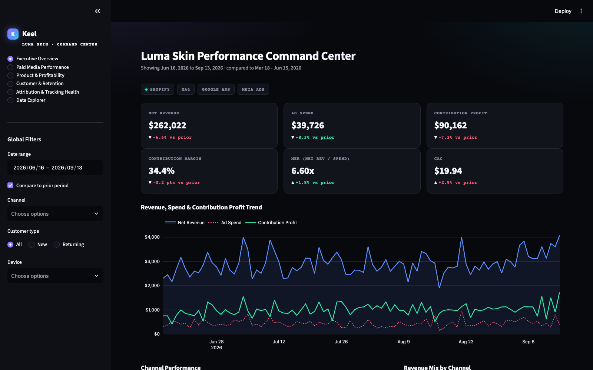
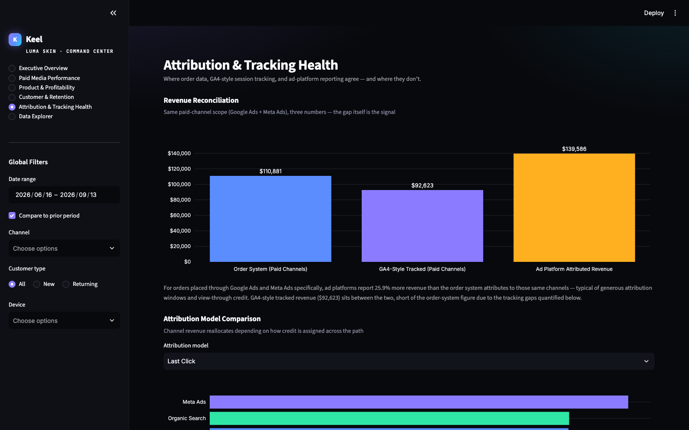
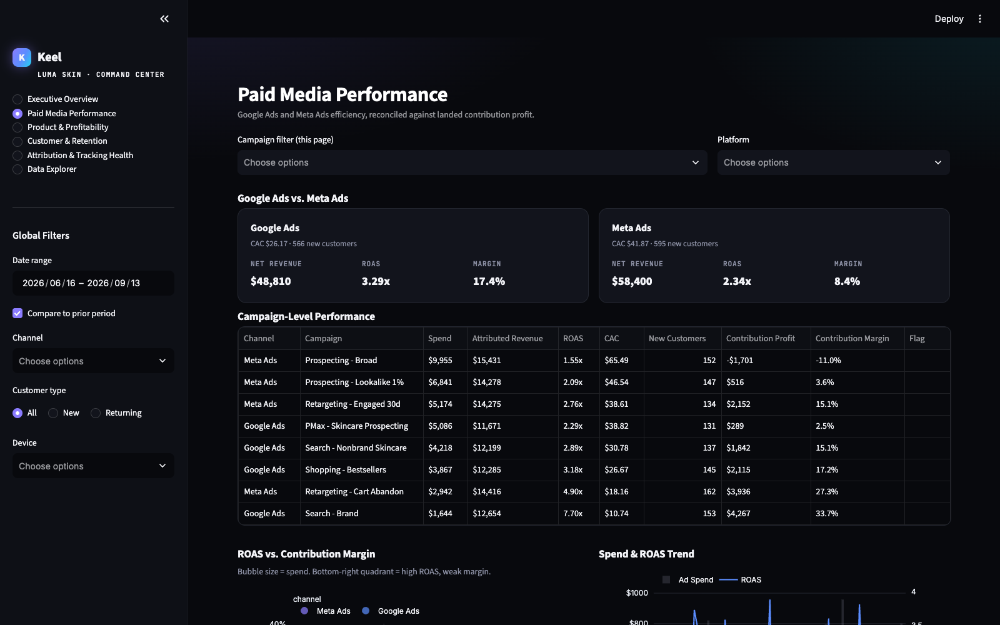
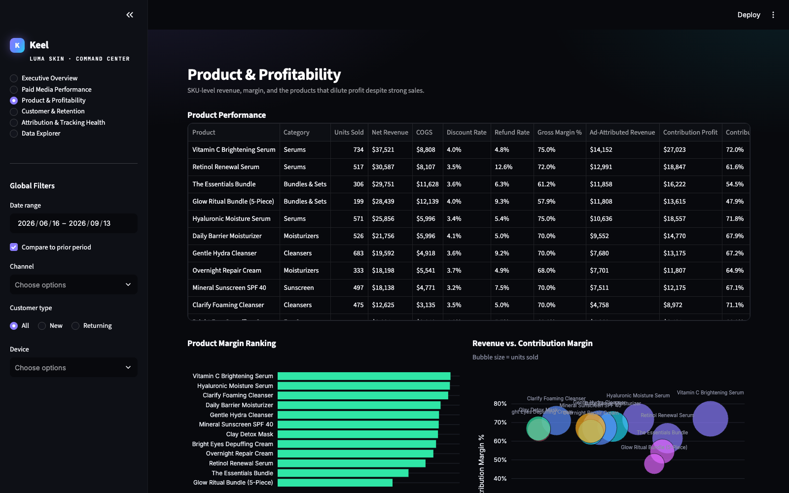
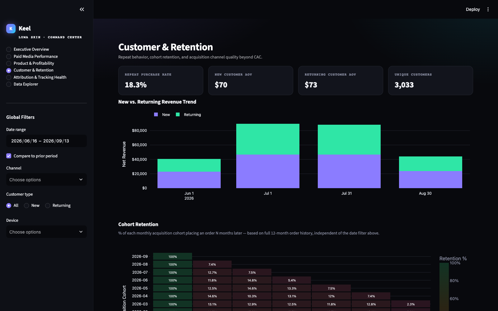
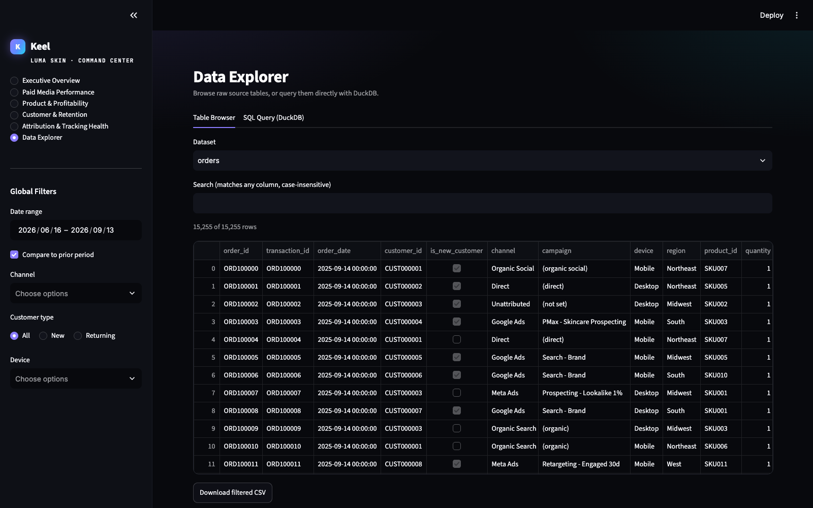

# Keel

Keel is an e-commerce analytics tool for tracking profit and marketing attribution in one place — the kind of thing you build when you're tired of Shopify, GA4, Google Ads, and Meta Ads all reporting a different revenue number for the same week, and nobody in the room agreeing on whether a campaign is actually making money.

Most teams manage paid media against platform ROAS. That number looks great right up until you subtract COGS, shipping, payment fees, discounts, and refunds — at which point a "4x ROAS" campaign can turn out to be losing money on every order. Keel is built around contribution profit first, and treats ROAS and CAC as inputs to that number rather than the goal themselves.

This build is wired up to Luma Skin, a DTC skincare business, running on a full year of modeled order, ad-spend, and session data — around 15,000 orders across twelve SKUs and four marketing channels. The dataset is deliberately imperfect: missing UTMs, a handful of duplicate purchase events, some orders with no session match at all — the same mess any real GA4/Shopify setup accumulates over a year, which is what makes the tracking-health page worth having.

## What's in it

The sidebar controls a shared date range, comparison-period toggle, and channel/customer-type/device filters — every page and chart reacts to them.

**Executive Overview** — the numbers that matter first: net revenue, ad spend, contribution profit, contribution margin, MER, CAC, each with a period-over-period delta. Below that, a combined revenue/spend/profit trend, a full channel table, revenue mix, and a new-vs-returning breakdown. A key insights panel and a "where to look next" panel are generated from whatever's currently filtered — not fixed copy.

**Paid Media Performance** — Google Ads against Meta Ads, campaign by campaign, with spend, attributed revenue, ROAS, CAC, and contribution margin side by side. A ROAS-vs-margin scatter makes it obvious when a campaign looks efficient on the platform's own terms but isn't actually profitable once costs are counted.

**Product & Profitability** — revenue, COGS, discount rate, refund rate, and margin per SKU. The bundles are the interesting case here: they carry a noticeably higher average order value than single-item purchases, but a lower margin — heavier discounting plus a higher cost ratio eats the gain.

**Customer & Retention** — repeat purchase rate, AOV by customer type, a monthly cohort retention heatmap, and acquisition channels compared not just on CAC but on what their customers are actually worth after the first order.

**Attribution & Tracking Health** — this is the page that does the most work. It reconciles order-system revenue against GA4-style tracked revenue and what the ad platforms self-report (spoiler: the platforms report meaningfully more than what the order system attributes to those same channels). You can switch between last-click, first-click, linear, and a data-informed heuristic and watch channel credit shift. There's a funnel, a 0–100 tracking health score, a breakdown of what's actually broken, and a set of concrete GTM/GA4 fixes for each issue.

**Data Explorer** — a table browser with search and CSV export, plus a DuckDB SQL console with a few pre-written queries, for anyone who'd rather just query the tables directly.

## How it's put together

```
data/*.csv
    │
    ▼
src/data_loader.py    — loads, joins, and caches the tables; owns the shared Filters object
    │
    ▼
src/metrics.py        — every KPI, channel/product/cohort rollup, attribution model, funnel and
                         tracking-health calculation, defined once
    │
    ├──► src/insights.py   — the key-insights and recommendation copy, generated from the live tables
    │
    ▼
src/charts.py          — Plotly figure builders, one shared visual system
    │
    ▼
app.py                 — page routing, sidebar filters, layout
```

Nothing gets calculated twice in two different places. Every page pulls from `metrics.py`, so a number means the same thing wherever it shows up — which is the whole point of a tool like this existing.

## Data model

| Table | Grain | Key columns |
|---|---|---|
| `products.csv` | one row per SKU | `product_id`, `product_name`, `category`, `unit_price`, `unit_cogs`, `launch_date` |
| `customers.csv` | one row per customer | `customer_id`, `first_order_date`, `acquisition_channel`, `acquisition_campaign`, `region`, `device` |
| `orders.csv` | one row per order line | `order_id`, `transaction_id`, `order_date`, `customer_id`, `is_new_customer`, `channel`, `campaign`, `device`, `region`, `product_id`, `quantity`, `unit_price`, `gross_item_revenue`, `discount_amount`, `shipping_revenue`, `tax_amount`, `gross_revenue`, `cogs`, `shipping_cost`, `payment_fee` |
| `refunds.csv` | one row per refund | `refund_id`, `order_id`, `refund_date`, `refund_amount`, `refund_reason` |
| `ad_spend.csv` | one row per channel/campaign/ad set/day | `date`, `channel`, `campaign`, `ad_set`, `product_focus`, `spend`, `impressions`, `clicks`, `platform_reported_revenue`, `platform_reported_conversions` |
| `web_sessions.csv` | one row per session touchpoint | `session_id`, `session_date`, `journey_id`, `customer_id`, `source`, `medium`, `campaign`, `utm_source`, `utm_medium`, `utm_campaign`, `device`, `landing_page`, `touch_position`, `touch_count`, `viewed_product`, `added_to_cart`, `began_checkout`, `is_purchase`, `transaction_id`, `revenue_ga4` |

`journey_id` is an internal session-stitching key present on every touchpoint in a reconstructed purchase path — that's what the multi-touch attribution models run on. `transaction_id` behaves the way it actually does in GA4: it's only populated on the purchase hit itself, it's occasionally duplicated (a double-fired purchase event), and it's simply missing for a slice of orders entirely. That gap is the input to the tracking-health score, not an afterthought.

A few things worth knowing about how the year plays out: roughly 1 in 8 orders has no session match at all, a fifth or so of paid-channel sessions are missing a campaign parameter, ad platforms report noticeably more revenue than the order system attributes to those channels, one serum and both bundles run a higher-than-average refund rate, and the whole year carries the seasonality you'd expect — a Black Friday/Cyber Monday spike, a softer January, a slight summer dip.

## Metric definitions

Every formula below lives in exactly one place, `src/metrics.py`.

| Metric | Formula |
|---|---|
| Gross Revenue | `Σ (unit_price × quantity)` — pre-discount product sales |
| Net Revenue | `Gross Revenue − Discounts + Shipping Revenue + Tax` (refunds aren't netted here — see Contribution Profit) |
| Refund Rate | `Refunds ÷ Gross Revenue` |
| Ad Spend | `Σ spend` across Google Ads + Meta Ads |
| Blended ROAS | `Net Revenue ÷ Total Ad Spend` |
| MER | `Net Revenue ÷ Total Ad Spend` — mathematically the same ratio as blended ROAS, shown under both names because people ask for it both ways |
| COGS | `Σ (unit_cogs × quantity)` |
| Shipping Cost | actual fulfillment cost, distinct from the shipping fee charged to the customer |
| Payment Processing Fees | `2.9% × charged amount + $0.30` per order |
| **Contribution Profit** | `Net Revenue − Ad Spend − COGS − Shipping Cost − Payment Fees − Refunds` |
| Contribution Margin % | `Contribution Profit ÷ Net Revenue` |
| CAC | `Ad Spend ÷ New Customers Acquired` |
| Repeat Purchase Rate | customers with 2+ orders ÷ all customers in the active filter |
| AOV | `Net Revenue ÷ Orders` |
| Profit per Order | `Contribution Profit ÷ Orders` |
| Attributed vs. Unattributed Revenue | orders with vs. without a matching session, joined on `transaction_id` |
| Tracking Health Score | 100, minus weighted penalties for missing UTMs, duplicate purchase events, revenue mismatches, unattributed orders, and missing campaign values |

A couple of judgment calls worth stating plainly: refunds get attributed back to the order's original date rather than the refund date, so a given period's profit reflects the orders actually placed in it. COGS isn't netted back on refunded orders — that's a conservative choice, treating refunded stock as non-restockable rather than assuming it goes back on the shelf. Product-level margin (on the Product & Profitability page) excludes shipping and payment fees, since those are tracked at the order level and don't split cleanly per line item.

## Attribution

The tracking-health page rebuilds multi-touch paths from `web_sessions.csv` and lets you compare four ways of crediting a conversion:

- **Last click** — full credit to the final touchpoint, the default most tools ship with
- **First click** — full credit to whatever started the journey
- **Linear** — credit split evenly across every touchpoint
- **Data-informed** — a U-shaped weighting (40% first touch, 40% last touch, 20% spread across the middle)

The last one is a heuristic, not a trained model, and the page says so rather than dressing it up. A genuine data-driven attribution model needs a large volume of converting and non-converting paths plus a trained conversion-probability model — that's a warehouse-scale project, not something a single app should quietly pretend to be doing. Orders with no session match at all stay unattributed under every model, because credit can only be reallocated across a path that was actually tracked.

## Looker Studio

There's a Looker Studio build of the four core pages alongside this app, in `looker_studio/` — same data, same metric definitions, exported as flat tables instead of read by Streamlit. See `looker_studio/README.md`.

## Running it

Needs Python 3.11+.

```bash
cd keel

python3 -m venv .venv
source .venv/bin/activate          # Windows: .venv\Scripts\activate

pip install -r requirements.txt

python data/generate_demo_data.py

streamlit run app.py
```

Opens at `http://localhost:8501`. No API keys or external services required — it runs entirely against the local CSVs.

## Layout

```
keel/
├── app.py
├── requirements.txt
├── README.md
├── data/
│   ├── generate_demo_data.py
│   ├── products.csv
│   ├── customers.csv
│   ├── orders.csv
│   ├── refunds.csv
│   ├── ad_spend.csv
│   └── web_sessions.csv
├── src/
│   ├── data_loader.py
│   ├── metrics.py
│   ├── charts.py
│   ├── styles.py
│   └── insights.py
└── assets/
```

## About the data

Luma Skin isn't a live client — real client data doesn't leave an NDA, and I'm not going to pretend otherwise. The dataset here is modeled: a year of orders, sessions, and ad spend generated from a fixed seed so the numbers are reproducible, with the kind of tracking noise (missing UTMs, a few duplicate events, some unattributed orders) that any real GA4/Shopify setup accumulates over a year. That noise is the point — it's what the Attribution & Tracking Health page is built to catch.

Swapping in a live source is mostly a matter of replacing what `src/data_loader.py` reads from: Shopify's Admin API or a nightly export in place of `orders.csv`, GA4's BigQuery export in place of `web_sessions.csv`, the Google Ads and Meta Marketing APIs in place of `ad_spend.csv`. The metric definitions, page layout, and insight logic in `src/metrics.py` and `src/insights.py` don't need to change — they're already written against table shapes, not against this specific dataset.

## Screenshots

| Executive Overview | Attribution & Tracking Health |
|---|---|
|  |  |

| Paid Media Performance | Product & Profitability |
|---|---|
|  |  |

| Customer & Retention | Data Explorer |
|---|---|
|  |  |
